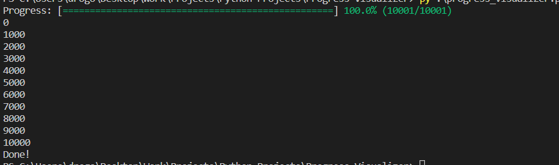

# Progress Visualizer

## Description
This is a simple module that allows you to visualize the progress of iterations in a loop. It is useful for long loops that you want to keep track of.

This module is inspired by [tqdm](https://pypi.org/project/tqdm/). A much much simpler version of it though :D


## Features
- The progress bar is colored, so it is easy to interpret.
- The progress bar retains its position in the terminal, so you can print other things in the loop while the progress bar is running without messing up the terminal (As long as the progress bar's original position is in view while running)
- The styling of the progress bar can be customized. You can change the color of the bar, the width of the bar, and the character used to fill the bar.

## Usage
1. Construct a ProgressVisualizer object
```python
pv = ProgressVisualizer()
```

2. Pass your `Iterable` to the public method `visualize()` in the for loop.
```python
for item in pv.visualize(my_iterable):
    # Do something with item
```
## Sample Code
Example:
```python
my_list = [i for i in range(10001)]
pv = ProgressVisualizer()

for item in pv.visualize(my_list):
    if item % 1000 == 0:
        print(item)

print('Done!')
```

After complete execution of the previous code, the terminal will look like this:

